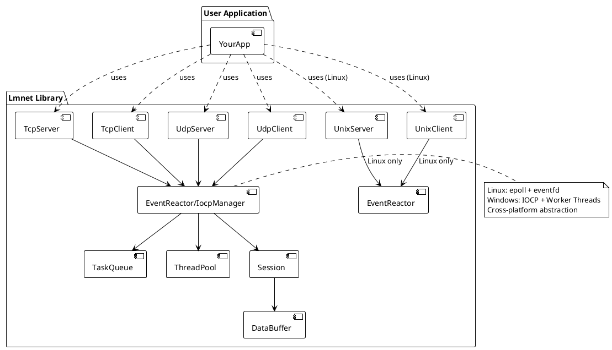

# Lmnet

A modern C++ cross-platform asynchronous lmnet library with high performance. It provides TCP, UDP, and UNIX domain socket support across Linux and Windows platforms, focusing on event-driven programming, resource management, and scalable network applications. Suitable for learning, prototyping, and building real-world network services.

## Features

- **Cross-platform support**: Linux (epoll) and Windows (IOCP)
- **High-performance I/O**: Event-driven asynchronous I/O with platform-optimized implementations
- **Comprehensive socket support**: TCP/UDP client & server, UNIX domain sockets (Linux)
- **Centralized resource management**: Unified IOCP manager on Windows for optimal resource utilization
- **Thread pool integration**: Efficient task queue and worker thread management
- **Session management**: Advanced connection lifecycle handling
- **Customizable event handlers**: Flexible callbacks for read/write/error/close events
- **Resource-safe shutdown**: Graceful exit mechanisms with proper resource cleanup
- **Production-ready**: Comprehensive unit tests and real-world examples

## Installation

### Prerequisites

Lmnet depends on the [lmcore library](https://github.com/lmshao/lmcore). You have two options to satisfy this dependency:

#### Option 1: System Installation (Recommended)

Install lmcore to your system first:

```bash
# Clone and install lmcore
git clone https://github.com/lmshao/lmcore.git
cd lmcore
mkdir build && cd build
cmake ..
make -j$(nproc)
sudo make install  # Install to /usr/local
```

Then build lmnet:

```bash
git clone https://github.com/lmshao/lmnet.git
cd lmnet
mkdir build && cd build
cmake ..
make -j$(nproc)
```

#### Option 2: Local Development Setup

Place lmcore and lmnet in the same parent directory:

```bash
# Directory structure should be:
# parent_directory/
# ├── lmcore/     (clone lmcore here)
# └── lmnet/      (clone lmnet here)

git clone https://github.com/lmshao/lmcore.git
git clone https://github.com/lmshao/lmnet.git

cd lmnet
mkdir build && cd build
cmake ..  # Will automatically find lmcore in sibling directory
make -j$(nproc)
```

### Build Configuration

The CMake build system will automatically:
1. First try to find system-installed lmcore (`find_package(lmcore)`)
2. If not found, look for lmcore in the sibling directory `../lmcore`
3. If neither is found, display helpful error messages with installation instructions

### Linux

Build with CMake:

```bash
cd lmnet  # After setting up lmcore dependency as described above
mkdir build && cd build
cmake ..
make -j$(nproc)
```

### Windows

**Prerequisites:**
- Visual Studio 2019 or later (with C++17 support)
- CMake 3.16 or later

**Build steps:**

```powershell
cd lmnet  # After setting up lmcore dependency as described above
mkdir build
cd build
cmake .. -G "Visual Studio 16 2019" -A x64
cmake --build . --config Debug
# or
cmake --build . --config Release
```

### Platform-Specific Features

**Linux**: Uses `epoll` for high-performance event-driven I/O with `eventfd` for graceful shutdown.

**Windows**: Uses `IOCP` (I/O Completion Ports) with a centralized manager for optimal resource utilization:
- Single IOCP instance shared across all network components
- Configurable worker thread pool (defaults to CPU core count)
- Automatic socket registration/deregistration
- Efficient completion event handling

## Quick Start

Create a simple TCP echo server:

```cpp
#include <lmnet/tcp_server.h>

#include <iostream>
#include <memory>
#include <thread>

class MyListener : public IServerListener {
public:
    void OnError(std::shared_ptr<Session> clientSession, const std::string &errorInfo) override {}
    void OnClose(std::shared_ptr<Session> clientSession) override {}
    void OnAccept(std::shared_ptr<Session> clientSession) override
    {
        std::cout << "OnAccept: from " << clientSession->ClientInfo() << std::endl;
    }
    void OnReceive(std::shared_ptr<Session> clientSession, std::shared_ptr<DataBuffer> buffer) override
    {
        if (clientSession->Send(buffer)) {
            std::cout << "send echo data ok." << std::endl;
        }
    }
};

int main(int argc, char **argv)
{
    uint16_t port = 7777;
    auto tcp_server = TcpServer::Create("0.0.0.0", port);
    auto listener = std::make_shared<MyListener>();
    tcp_server->SetListener(listener);
    tcp_server->Init();
    tcp_server->Start();
    std::cout << "Listen on port 0.0.0.0:" << port << std::endl;
    while (true) {
        std::this_thread::sleep_for(std::chrono::hours(24));
    }
    return 0;
}
```

More examples can be found in the [`examples/`](examples/) directory.

## API Reference

- See header files in [`include/lmnet/`](include/lmnet/) for detailed API documentation.
- Key classes: `TcpServer`, `TcpClient`, `UdpServer`, `UdpClient`, `EventReactor`, `Session`, etc.

## Testing

Run unit tests after building:

### Linux Testing

```bash
cd build
ctest
```

### Windows Testing

```powershell
cd build
# Run all tests
ctest -C Debug
# or run specific tests
.\tests\unit\Debug\test_tcp.exe
.\tests\unit\Debug\test_udp.exe
```

## Development & Debugging

### Windows Development

For development on Windows, you can use Visual Studio IDE:

1. Open Visual Studio
2. Select "Open a local folder" and choose the project root directory
3. Visual Studio will automatically detect CMake and configure the project
4. Set startup project to one of the test executables or examples
5. Use F5 to run with debugging

**Debugging Tips:**
- Set breakpoints in your event handlers (`OnAccept`, `OnReceive`, etc.)
- Monitor IOCP worker threads in the debugger
- Use Visual Studio's diagnostic tools to analyze performance
- Check the Output window for lmnet library logs

**Windows-specific considerations:**
- IOCP manager automatically initializes when the first network component starts
- All network components share the same IOCP instance for efficiency
- Worker thread count is automatically set to CPU core count (configurable)
- Use Windows Event Viewer for system-level network debugging

## Architecture


<details>
<summary>PlantUML source</summary>


</details>

## Contributing

Contributions are welcome! Please open issues or pull requests for bug reports, feature requests, or improvements.

## License

This project is licensed under the MIT License. See [LICENSE](LICENSE) for details.