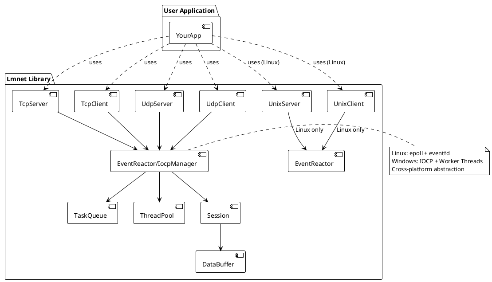

# Lmnet（网络库）

一个现代 C++ 跨平台异步网络库，具备高性能特性。支持 Linux 和 Windows 平台上的 TCP、UDP 和 UNIX 域套接字，专注于事件驱动编程、资源管理和可扩展的网络应用。适合学习、原型开发和实际服务搭建。

## 特性

- **跨平台支持**：Linux（epoll）和 Windows（IOCP）
- **高性能 I/O**：事件驱动异步 I/O，针对不同平台优化实现
- **全面的套接字支持**：TCP/UDP 客户端与服务端，UNIX 域套接字（Linux）
- **集中式资源管理**：Windows 上统一的 IOCP 管理器，优化资源利用
- **线程池集成**：高效的任务队列与工作线程管理
- **会话（Session）管理**：完善的连接生命周期处理
- **可自定义事件处理器**：灵活的读/写/错误/关闭事件回调
- **资源安全释放**：优雅的退出机制和适当的资源清理
- **生产就绪**：全面的单元测试与真实示例

## 安装

### 前置依赖

Lmnet 依赖于 [lmcore 库](https://github.com/lmshao/lmcore)。你有两种方式来满足这个依赖：

#### 方式一：系统安装（推荐）

首先将 lmcore 安装到系统中：

```bash
# 克隆并安装 lmcore
git clone https://github.com/lmshao/lmcore.git
cd lmcore
mkdir build && cd build
cmake ..
make -j$(nproc)
sudo make install  # 安装到 /usr/local
```

然后构建 lmnet：

```bash
git clone https://github.com/lmshao/lmnet.git
cd lmnet
mkdir build && cd build
cmake ..
make -j$(nproc)
```

#### 方式二：本地开发设置

将 lmcore 和 lmnet 放在同一个父目录下：

```bash
# 目录结构应该是：
# parent_directory/
# ├── lmcore/     (在这里克隆 lmcore)
# └── lmnet/      (在这里克隆 lmnet)

git clone https://github.com/lmshao/lmcore.git
git clone https://github.com/lmshao/lmnet.git

cd lmnet
mkdir build && cd build
cmake ..  # 会自动在同级目录中找到 lmcore
make -j$(nproc)
```

### 构建配置

CMake 构建系统会自动：
1. 首先尝试查找系统安装的 lmcore（`find_package(lmcore)`）
2. 如果未找到，在同级目录 `../lmcore` 中查找 lmcore
3. 如果两者都未找到，显示有用的错误信息和安装指导

### Linux

使用 CMake 构建：

```bash
cd lmnet  # 在按照上述说明设置好 lmcore 依赖后
mkdir build && cd build
cmake ..
make -j$(nproc)
```

### Windows

**前提条件：**
- Visual Studio 2019 或更高版本（支持 C++17）
- CMake 3.16 或更高版本

**构建步骤：**

```powershell
cd lmnet  # 在按照上述说明设置好 lmcore 依赖后
mkdir build
cd build
cmake .. -G "Visual Studio 16 2019" -A x64
cmake --build . --config Debug
# 或者
cmake --build . --config Release
```

### 平台特定功能

**Linux**：使用 `epoll` 实现高性能事件驱动 I/O，配合 `eventfd` 实现优雅关闭。

**Windows**：使用 `IOCP`（I/O 完成端口）和集中式管理器实现最优资源利用：
- 所有网络组件共享单一 IOCP 实例
- 可配置工作线程池（默认为 CPU 核心数）
- 自动套接字注册/注销
- 高效的完成事件处理

## 快速开始

创建一个简单的 TCP echo 服务器：

```cpp
#include <lmnet/tcp_server.h>
#include <iostream>
#include <memory>
#include <thread>

class MyListener : public IServerListener {
public:
    void OnError(std::shared_ptr<Session> clientSession, const std::string &errorInfo) override {}
    void OnClose(std::shared_ptr<Session> clientSession) override {}
    void OnAccept(std::shared_ptr<Session> clientSession) override {
        std::cout << "OnAccept: from " << clientSession->ClientInfo() << std::endl;
    }
    void OnReceive(std::shared_ptr<Session> clientSession, std::shared_ptr<DataBuffer> buffer) override {
        if (clientSession->Send(buffer)) {
            std::cout << "send echo data ok." << std::endl;
        }
    }
};

int main(int argc, char **argv) {
    uint16_t port = 7777;
    auto tcp_server = TcpServer::Create("0.0.0.0", port);
    auto listener = std::make_shared<MyListener>();
    tcp_server->SetListener(listener);
    tcp_server->Init();
    tcp_server->Start();
    std::cout << "Listen on port 0.0.0.0:" << port << std::endl;
    while (true) {
        std::this_thread::sleep_for(std::chrono::hours(24));
    }
    return 0;
}
```

更多示例见 [`examples/`](examples/) 目录。

## API 参考

- 详细 API 文档见 [`include/lmnet/`](include/lmnet/) 头文件。
- 主要类：`TcpServer`、`TcpClient`、`UdpServer`、`UdpClient`、`EventReactor`、`Session` 等。

## 测试

构建后运行单元测试：

### Linux

```bash
cd build
ctest
```

### Windows

```powershell
cd build
# 运行所有测试
ctest -C Debug
# 或运行特定测试
.\tests\unit\Debug\test_tcp.exe
.\tests\unit\Debug\test_udp.exe
```

## 开发与调试

### Windows 开发

在 Windows 平台使用 Visual Studio 开发：

1. 打开 Visual Studio
2. 选择"打开本地文件夹"，选择项目根目录
3. Visual Studio 会自动检测 CMake 并配置项目
4. 将启动项目设为测试可执行文件或示例之一
5. 使用 F5 进行调试运行

**调试技巧：**

- 在事件处理器中设置断点（`OnAccept`、`OnReceive` 等）
- 在调试器中监控 IOCP 工作线程
- 使用 Visual Studio 的诊断工具分析性能
- 查看输出窗口中的网络库日志

**Windows 特定注意事项：**

- IOCP 管理器在第一个网络组件启动时自动初始化
- 所有网络组件共享同一个 IOCP 实例以提高效率
- 工作线程数量自动设为 CPU 核心数（可配置）
- 使用 Windows 事件查看器进行系统级网络调试

## 架构


<details>
<summary>PlantUML 源码</summary>


</details>

## 贡献

欢迎提交 issue 或 pull request 反馈 bug、需求或改进建议。

## 许可证

本项目采用 MIT 许可证。详情请查看 [LICENSE](LICENSE) 文件。
