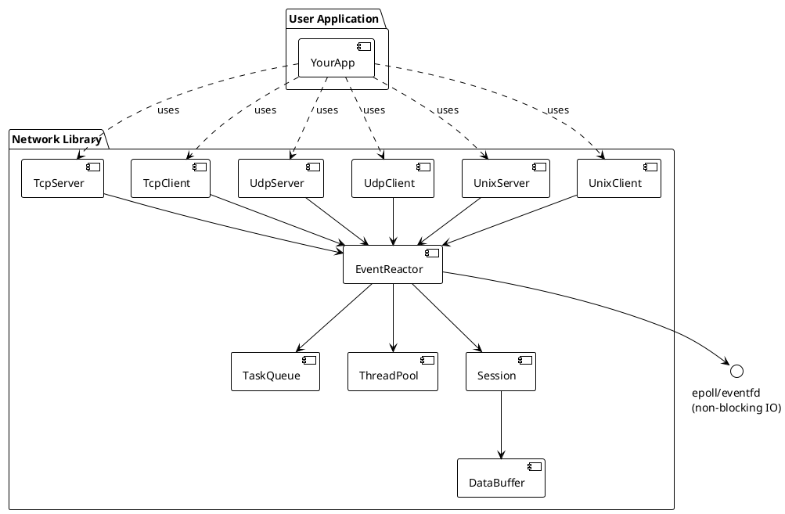

# Network（网络库）

一个现代 C++ 异步网络库，具备良好性能。支持 TCP、UDP 和 UNIX 域套接字，专注于事件驱动编程、资源管理和可扩展的网络应用。适合学习、原型开发和实际服务搭建。

## 特性
- 异步事件驱动 I/O（基于 epoll）
- 支持 TCP/UDP/UNIX socket 客户端与服务端
- 线程池与任务队列集成
- 会话（Session）管理
- 可自定义事件处理器（读/写/错误/关闭）
- 资源安全释放与优雅退出（基于 eventfd 唤醒）
- 单元测试与真实示例

## 安装
克隆仓库并用 CMake 构建：

```bash
git clone https://github.com/lmshao/network.git
cd network
mkdir build && cd build
cmake ..
make
```

## 快速开始
创建一个简单的 TCP echo 服务器：

```cpp
#include <network/tcp_server.h>
#include <iostream>
#include <memory>
#include <thread>

class MyListener : public IServerListener {
public:
    void OnError(std::shared_ptr<Session> clientSession, const std::string &errorInfo) override {}
    void OnClose(std::shared_ptr<Session> clientSession) override {}
    void OnAccept(std::shared_ptr<Session> clientSession) override {
        std::cout << "OnAccept: from " << clientSession->ClientInfo() << std::endl;
    }
    void OnReceive(std::shared_ptr<Session> clientSession, std::shared_ptr<DataBuffer> buffer) override {
        if (clientSession->Send(buffer)) {
            std::cout << "send echo data ok." << std::endl;
        }
    }
};

int main(int argc, char **argv) {
    uint16_t port = 7777;
    auto tcp_server = TcpServer::Create("0.0.0.0", port);
    auto listener = std::make_shared<MyListener>();
    tcp_server->SetListener(listener);
    tcp_server->Init();
    tcp_server->Start();
    std::cout << "Listen on port 0.0.0.0:" << port << std::endl;
    while (true) {
        std::this_thread::sleep_for(std::chrono::hours(24));
    }
    return 0;
}
```

更多示例见 [`examples/`](examples/) 目录。

## API 参考
- 详细 API 文档见 [`include/network/`](include/network/) 头文件。
- 主要类：`TcpServer`、`TcpClient`、`UdpServer`、`UdpClient`、`EventReactor`、`Session` 等。

## 测试
构建后运行单元测试：

```bash
cd build
ctest
```

## 架构


<details>
<summary>PlantUML 源码</summary>


</details>

## 贡献
欢迎提交 issue 或 pull request 反馈 bug、需求或改进建议。

## 许可证
本项目采用 MIT 许可证，详见 [LICENSE](LICENSE)。
